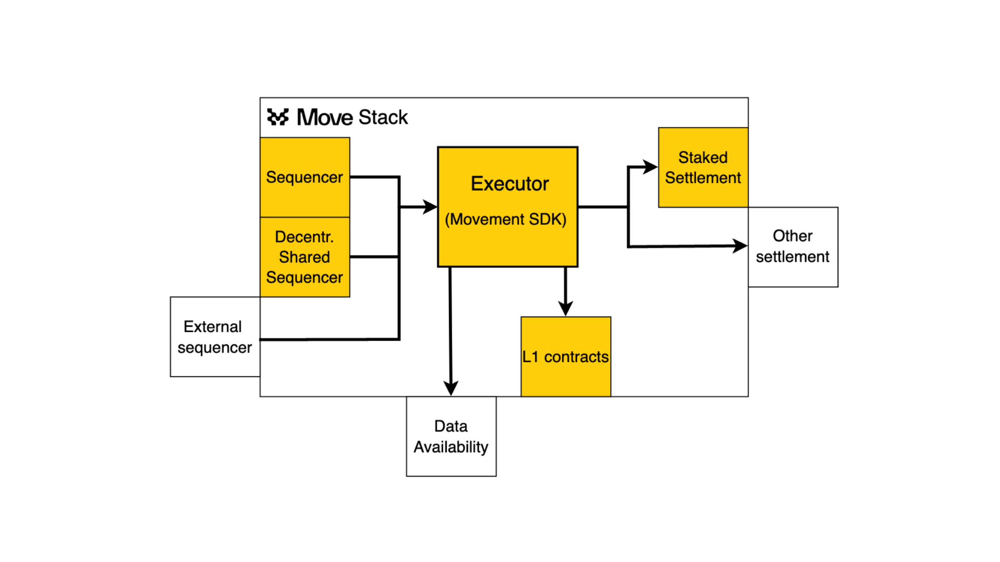
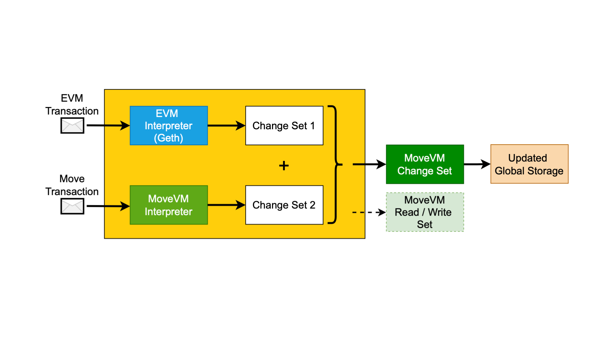

# Movement Frameworks

The Movement Network is built on robust frameworks that enable the creation, deployment, and management of Move-based rollups. These frameworks include the Move Stack, Move Arena, and the Move Rollup Framework, each designed to enhance performance, security, and interoperability.

## Move Stack

The Move Stack is a collection of tools, components, and adapters that enable the creation of customizable Move rollups. It includes essential elements such as sequencing, data availability, and settlement mechanisms. The modular architecture of the Move Stack allows developers to select the most suitable components for their specific applications, ensuring optimal performance and security.

The Move Stack's configurable components include:
- **Sequencer**: Developers can opt for the default M1 decentralized shared sequencing service or choose a self-reliant sequencing mechanism.
- **Data Availability**: Supports various DA solutions, including Ethereum EIP-4844 blobs, 0G, Avail, Celestia, EigenDA, and Near.
- **Settlement Mechanisms**: Offers options for optimistic (fraud proof), zk (validity proof) rollups, and staked (attestations) settlement mechanisms.

:::info
The Move Stack promotes standardization across critical infrastructure components, including wallet software, developer APIs, and block explorers. This standardization enhances interoperability and significantly improves the developer and user experience across the Move Arena ecosystem.
:::

## Move Arena

Move Arena provides a framework to deploy and join the Move rollups network. It offers benefits such as fast finality, interoperability, and shared economic security. This framework supports a network of application-specific chains, enhancing interoperability and shared liquidity. It allows the deployment of specialized rollups tailored to different use cases, such as DeFi, gaming, and supply chain applications.

:::info
The Move Arena supports the deployment of application-specific Move Rollups, providing cross-chain interoperability and shared liquidity. This setup enhances the efficiency and security of new rollups by leveraging a decentralized sequencer and multi-asset staking.
:::

## Move Rollup Framework

The Move Rollup framework provides a blueprint for creating Move-based rollups. It is a modular architecture where components can be configured to meet the specific needs of different applications. The framework includes key components such as the Move Executor, bridge contracts, a sequencer, a data availability service, and a settlement mechanism. This flexibility allows for the customization of rollups to optimize performance, cost, and security.

### Key Components of the Move Rollup Framework
- **Executor**: Processes transactions and generates new L2 blocks.
- **Bridge Contracts**: Facilitates asset deposits and withdrawals between L1 and the rollup.
- **Sequencer**: Orders transactions.
- **Data Availability Service**: Ensures transaction data accessibility to the settlement mechanism.
- **Settlement Mechanism**: Verifies transaction execution correctness through various methods (e.g., zk-proofs, optimistic rollups, staked rollups).

:::info
The modularity of the Move Rollup framework allows developers to select different data availability solutions, settlement mechanisms, and sequencing options, customizing their rollups to best fit their application's needs.
:::

## Transaction Lifecycle

Understanding the transaction lifecycle is crucial for understanding how Move Rollups achieve efficient and secure transaction finality. This lifecycle outlines the steps from the initial submission of a transaction to its final settlement, ensuring that every transaction is processed correctly and securely.

The transaction lifecycle within a Move Rollup involves:
1. **Submission**: A transaction is submitted to the mempool.
2. **Sequencing**: The sequencer extracts a batch of transactions from the mempool and orders them.
3. **Data Publication**: The sequencer publishes the transaction data to the DA service.
4. **Execution**: The executor processes the transactions, resulting in a new L2 state.
5. **Settlement**: The new state is published to L1 in the bridge contract for final settlement.

This process ensures efficient and secure transaction finality.

<!--  -->