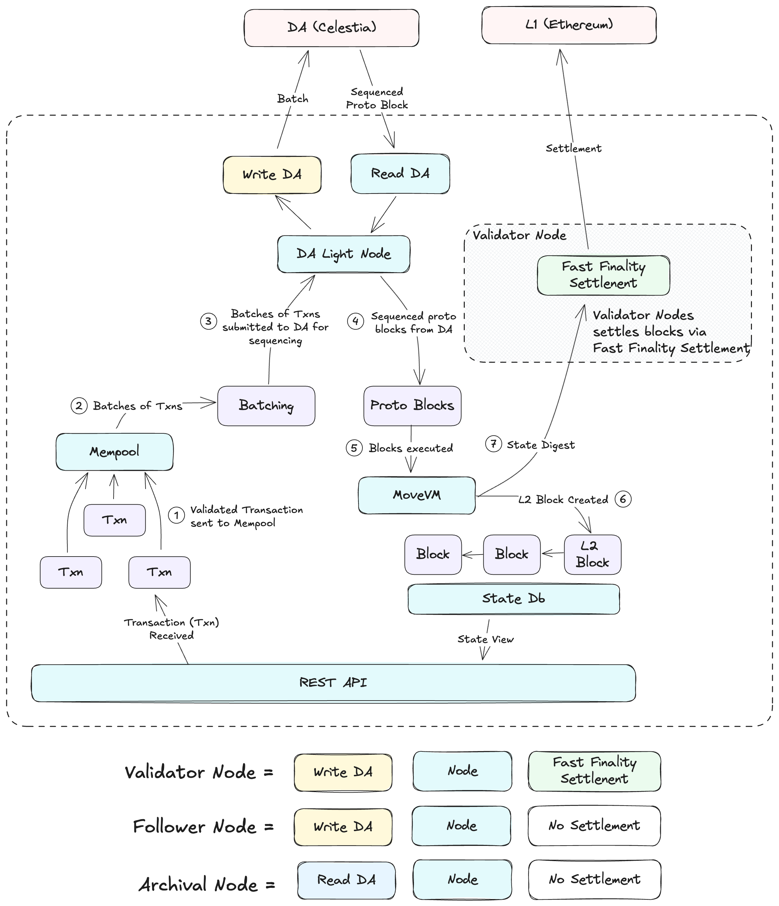

# High-level architecture



## Data Availability

The DA service is used to store transaction data and make it available to the network. The service is accessed via [DA light nodes](./node_level_architecture.md#da-light-node).

Celestia is used as the Data Availability (DA) layer.

## Sequencing

In order to protect the DA layer from spam, only certain [full nodes](./node_level_architecture.md#full-node) receive authorization to sequence transactions in ordered transaction-batches. These full nodes provide basic sequencing for transactions ingressed from the users. The full node then sends the transaction-batch to the DA service using the [DA light node](node_level_architecture.md#da-light-node).

The DA service sequences the proto-blocks and provides the final ordering of transactions to the network in L2-blocks.

## Settlement

The network uses the [Fast Finality Settlement Module](../Introduction/technical_details.md#fast-finality-settlement-module) for transaction finality.

[Validator nodes](./node_level_architecture.md#validator-node) check against the [postconfirmed](../Introduction/technical_details.md#fast-finality-settlement-module) state root on L1 to increase their security and reduce the risk of providing wrong state updates to users. Initially - with the training wheels in place - a specialized node, called Core-Validator, is responsible for updating the state on L1.

As the training wheels are removed the network will move to a decentralized model where validators will be able to attest to the correctness of state transitions, and a supermajority of validators will be required to advance the state roots on L1.

## Fees

Transaction fees are paid in the token of the L2 network. They are used to pay for the data availability, sequencing, execution and settlement services:

```
fee = data_availability_fee + sequencing_fee + execution_fee + settlement_fee
```

For more information on fees, see [this MIP](https://github.com/movementlabsxyz/MIP/pull/19).
